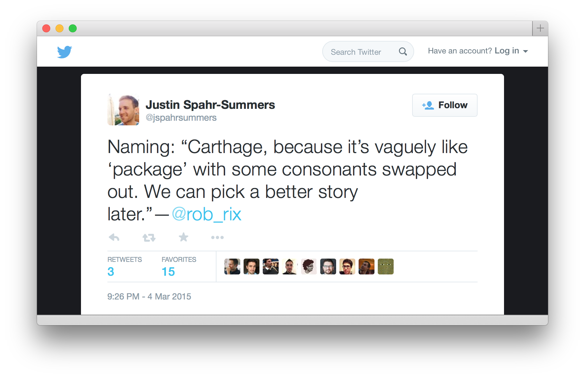

slidenumbers: true

# Reusing Code on Mac and iOS

---

# Goals for Code Reuse
* Don't reinvent the wheel
* Discover existing wheels
* Easily package up wheels for reuse
* Introduce these wheels into our projects
* Manage wheel versions
* Update, fix, enhance wheels while using them

---

# Early iOS Support
- No Frameworks
- Lots and lots devs
- Entirely new Platform

---

# Favorite Methods of iOS Code Sharing
- Just copy in all the `*.h` and `*.m` files
- "Static Frameworks"
- Static Libraries with Resource Bundles
- "The common relative directory handshake"
- git submodules + subprojects
- no frameworks :(
- no Maven/Ruby Gems

---

# Enter Cocoapods
- Automated 
- sharing code *AND* resources
- versioning!
- Is this really the right solution?

---

# What's wrong with Cocoapods?
- It duplicates the work of some other tools
    - Xcode
    - Git
    - Github, Twitter

---

# And
- You have to wait [or contribute updates] for new features
    - Frameworks
    - Swift

---

# One more thing:
- Cocoapods automatically changes your project file and introduces a `.xcworkspace` that you must use.

---

# Steps to publish a cocoapod
1. Create an Xcode project [not strictly necessary]
2. Create a podspec
3. Publish the project to some shared repo (usually on github, bitbucket, etc)
4. Publish the podspec to some shared repo (which you have to maintain if you want private Cocoapods)

^ So if cocoapods isn't the right solution is there something better?

---

# FRAMEWORKS!!! iOS 8+

---

# Enter Carthage

---

> **Carthage** ...the simplest way to add frameworks to your Cocoa application
-- github.com/Carthage/Carthage

---

How do you import frameworks in Carthage?

---

What about publishing my own frameworks?

---

Submodules? blech.

---

# References
1 . [Framework Programming Guide](https://developer.apple.com/library/mac/documentation/MacOSX/Conceptual/BPFrameworks/Concepts/WhatAreFrameworks.html#//apple_ref/doc/uid/20002303-BBCEIJFI)
